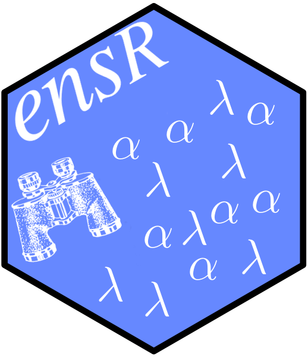

ensr: Elastic Net SearcheR 
===============================================================================

Elastic Net regression models combine both the L1 and L2 penalties of lasso and
ridge regression.  There are two penalty terms, lambda and alpha.  Lambda is a
complexity parameter and alpha is a balance between lasso and ridge.

The `cv.glmnet` function in [`glmnet`](https://cran.r-project.org/packag=glmnet)
will perform cross validation to find the value of lambda for a given value of
alpha.  `cv.glmnet` does not search over values of alpha.  The ensr package
builds a grid of alpha and lambda values and, using cross-validation, suggests
preferable values for both lambda and alpha.

After installing this package we encourage you to read the vignette to see
examples.

```r
vignette("ensr-examples", package = "ensr")
```

## Installing ensr

ensr is not currently on [CRAN](https://cran.r-project.org/). You can install
via github or after cloning the repo.

There are several ways you can install ensr.  If you are working on a Windows
machine you will need to have [Rtools](https://cran.r-project.org/bin/windows/Rtools/) installed.

### Development version from Github

Within an active R session evaluate the following:
```r
if ('remotes' %in% rownames(installed.packages())) {
  install.packages('devtools', repos = "https://cran.rstudio.com")
}
remotes::install_github("dewittpe/ensr", build_opts = c("--no-resave-data"))
```

### Clone and Install
There are detailed instructions for cloning the repo in the `CONTRIBUTING.md`
file.  Windows users need to read the details for cloning the repo so that
symbolic links will be handled correctly.  After cloning use the makefile to
build, check, and install the ensr package, e.g.,

    make install

## Contributing
Please read the `CONTRIBUTING.md` file.  There are details on the how to clone
the repo and the structure of this package.

